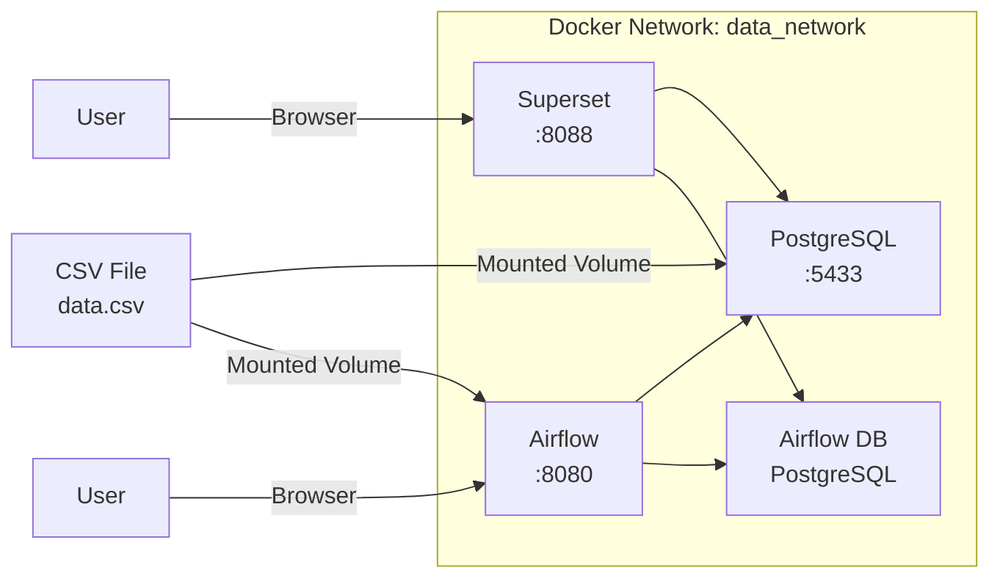

# Data Pipeline Project: Analytics Dashboard with Airflow, Superset, and PostgreSQL

[](https://airflow.apache.org/)
[](https://superset.apache.org/)
[](https://www.postgresql.org/)
[](https://www.docker.com/)

## 🎯 Project Overview

This project implements a complete data pipeline for business analytics:
- **Data Source**: CSV files containing test data
- **Orchestration**: Apache Airflow for automated ETL workflows
- **Storage**: PostgreSQL for structured data storage
- **Visualization**: Apache Superset for interactive dashboards
- **Containerization**: Docker for reproducible deployment

## 🏗️ Architecture

The project consists of three main services running in isolated Docker containers, connected via a dedicated Docker network.



### Service Overview

| Service | Container Name | Port | Purpose |
| :--- | :--- | :--- | :--- |
| **Apache Superset** | `superset_app` | `8088` | Interactive dashboards and data visualization |
| **PostgreSQL** | `postgres_data` | `5433` | Persistent storage for business data |
| **Apache Airflow** | `airflow` | `8080` | Workflow orchestration and scheduled ETL |
| **Airflow DB** | `airflow_db` | (internal) | PostgreSQL database for Airflow metadata |

### Data Flow

1.  **Data Source**: A CSV file (`data.csv`) is placed in the `./data/` directory on the host machine.
2.  **Volume Mounting**: The `./data/` directory is mounted into both the `postgres_data` and `airflow` containers, making the CSV file accessible to both services.
3.  **Scheduled ETL (Airflow)**:
    - The Airflow DAG `refresh_dashboard` runs daily at 9:00 AM.
    - It reads the CSV file from the mounted volume.
    - It transforms and loads the data into the `company_data` table in PostgreSQL.
4.  **Visualization (Superset)**:
    - Superset connects to the PostgreSQL database using the hostname `postgres_data`.
    - Dashboards are built on top of the `company_data` dataset.
    - Auto-refresh is configured on the dashboard to show the latest data.

## 🚀 Quick Start

### Prerequisites
- Docker & Docker Compose
- Git
- DBeaver (optional, for database exploration)

### Setup

1. **Clone the repository**
   ```bash
   git clone https://github.com/yourusername/data-pipeline-project.git
   cd data-pipeline-project
Create network and run containers

bash
docker network create data_network
docker-compose up -d
Initialize Superset

bash
docker exec -it superset_app superset db upgrade
docker exec -it superset_app superset fab create-admin
docker exec -it superset_app superset init
Access services

Superset: http://localhost:8088 (admin/admin)
Airflow: http://localhost:8080 (admin/admin)
PostgreSQL: localhost:5433 (data_user/data_password)
📊 Data Pipeline Workflow

CSV Upload: Place your data.csv in the ./data/ directory
Load Data: Manual or automated loading via Airflow DAG
Transform: Data cleaning and aggregation in Python
Store: PostgreSQL for persistent storage
Visualize: Superset dashboards for business insights
Automate: Airflow DAG runs daily at 9:00 AM
📂 Project Structure

.
├── README.md
├── docker-compose.yml          # Docker services configuration
├── .env.example                # Environment variables template
├── dags/
│   ├── refresh_dashboard.py    # Main ETL DAG
│   └── ab_test_analysis.py     # AB-testing DAG
├── scripts/
│   ├── load_data.py            # CSV loading script
│   ├── ab_test_calculator.py   # AB-test calculations
│   └── sql_queries.sql         # Analytical SQL queries
├── data/
│   └── data.csv                # Source data (gitignored)
└── notebooks/                  # Jupyter notebooks for exploration

🔧 Available DAGs

DAG Name	Description	Schedule
refresh_dashboard	Updates company data from CSV	Daily at 9:00 AM
ab_test_analysis	Runs AB-test calculations	Daily at 8:00 AM

📈 Sample Dashboards

Sales Overview: Revenue, profit, and growth trends
Employee Analytics: Department distribution, salaries, headcount
AB-Test Results: Statistical significance, conversion rates
Operational Metrics: Daily KPIs and alerts
🛠️ Development

Run ETL script locally

bash
python scripts/load_data.py
Test DAGs

bash
docker exec -it airflow python /opt/airflow/dags/refresh_dashboard.py
Connect to PostgreSQL

bash
docker exec -it postgres_data psql -U data_user -d my_dataset
